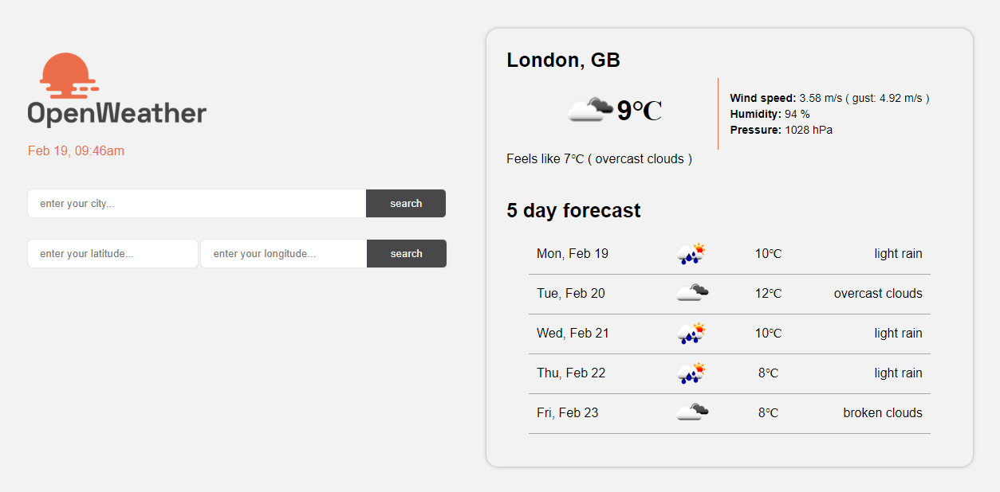

# Weather API (openweather)

### `npm start:dev`

## [GET] http:localhost:5005/weather
Render static page (form and widget weather)

## [POST] http:localhost:5005/weather.json
response (work postman)

Example Coordinate (Latitude and Longitude)

Odessa: 46.482952, 30.712481 \
Kyiv: 50.450001, 30.523333 \
Lviv: 49.842957, 24.031111 